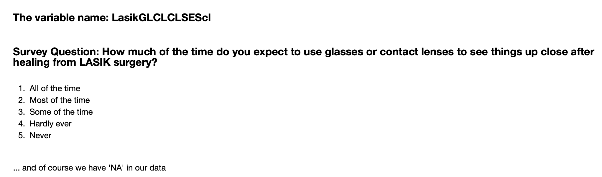

## Contributors
Lusha Cao (lcao10@jhmi.edu)

Kerry Goetz (kerry.goetz@nih.gov, kgoetz2@masonlive.gmu.edu)

Dina Mikdadi

Divya Palaniswamy

Yajing Song

Violet Zhang (violet.v.zhang@gsk.com)

## Background

Biomedical Research Data is notoriously challenging when it comes to FAIR (Findable, Accessible, Interoperable and Re-usable) principles. Often, in order to understand the data set from a clinical research study, one needs to understand the data dictionary and associated code list. This means that someone interested in the data needs to spend a lot of time to understand the relationship between many files of several types. Additionally, the case report forms (CRF) are often contained within pdf type files and sometimes the codebooks are separate files. In some cases, the crf files also contain handwritten annotations. The goal of this work is to create an automated method to merging data from each source to a single containerized object that includes enough meta-data for an outsider to make sense of the study. This is the means to the goal of making biomedical research data FAIR.

### All about the data
We are working with survey data from the Patient Reported Outcomes with LASIK (PROWL). This was a joint project for DOD/FDA/NIH. More information can be found at [FDA PROWL Website](https://www.fda.gov/medical-devices/lasik/lasik-quality-life-collaboration-project) and [NEI PROWL Website](https://prowl.nei.nih.gov/). We looked three data categories: Demographic, Pre-Operation survey responses and Post-Operation surveys.

We started with a annotated case report form (CRF) and seperate code book in pdf format. Cooresponding Data Dictionary and survey response data in csv. 

### Data Information:
* Cohort = 1100 people
* Demographic = 8 Data Elements (DE)
* Pre-OP = 142 DE
* Post-OP = 108 DE
* 6 data files but we used one for proof of concept (see note about data access)
* 42 PDFs (21 pairs of annotated CRF and code book)

Data is available on controlled access basis. Required to sign a user agreement before account approval. Low-barrier to access, basically just want to track usage and make sure no third party sharing. Request access at [NEI BRICS](https://brics.nei.nih.gov).

## Goals
### Target: 
  1. Extract schema from the data sets
  2. Capture inventories of the files in the directories
  * Bagit and Pandas as tools
  * How many variables and missing values are in each file
### Stretch: 
  1. Pulling data from CRFs and PDFs as a structured data format 
  2. Associate the variables with the descriptions 
  3. Validate the variables against the data dictionary and report the record that does not find a match
  
## Workflow  

## Presentations
[Project Concept](https://docs.google.com/document/d/1TnwnpWZsiipe2CH5zI_E20LvC_MvSOaQ_qIA1LlxgjM/edit?usp=sharing)

[Mid-way Lightning Talk](https://docs.google.com/presentation/d/1HCeoqp5jsKcanOoGPzKoNtMGqlKLhIXQKGbLvbgXUYs/edit?usp=sharing)

[Final Presentation]

### Dependencies:
* R
R version 3.5.1 (2018-07-02)
Platform: x86_64-apple-darwin13.4.0 (64-bit)
Running under: macOS  10.14.2
attached base packages:
[1] stats     graphics  grDevices utils     datasets  methods   base     

other attached packages:
[1] bindrcpp_0.2.2 dplyr_0.7.6    ggplot2_3.0.0 

loaded via a namespace (and not attached):
 [1] Rcpp_0.12.18     bindr_0.1.1      magrittr_1.5     tidyselect_0.2.4
 [5] munsell_0.5.0    uuid_0.1-2       colorspace_1.3-2 R6_2.2.2        
 [9] rlang_0.2.1      stringr_1.3.1    plyr_1.8.4       tools_3.5.1     
[13] grid_3.5.1       gtable_0.2.0     withr_2.1.2      htmltools_0.3.6 
[17] lazyeval_0.2.1   assertthat_0.2.0 digest_0.6.15    tibble_1.4.2    
[21] crayon_1.3.4     IRdisplay_0.5.0  purrr_0.2.5      repr_0.15.0     
[25] base64enc_0.1-3  IRkernel_0.8.12  evaluate_0.11    glue_1.3.0      
[29] labeling_0.3     pbdZMQ_0.3-3     stringi_1.2.4    compiler_3.5.1  
[33] pillar_1.3.0     scales_0.5.0     jsonlite_1.5     pkgconfig_2.0.1 
* Python
* Jupiter Notebook

### Input Data: 

### Shoe #1 - CRF
  -Read CRF
  -Put into Data Frame to do cool stuff
    1. headers in data - variable names to questions
    2. other fun stuff like text analysis, mesh terms
    
    [Shoe #1 notebook](https://github.com/NCBI-Hackathons/Females-Are-Insisting-on-Reproducibility-/blob/master/CRFPDF2PyDF.ipynb)
    
### Shoe #2 - Variable Cleanup
[Shoe 2 notebook](https://github.com/NCBI-Hackathons/Females-Are-Insisting-on-Reproducibility-/blob/master/shoe2_variable_cleanup.ipynb)

### Shoe #3 - Generate Stats Charts
-- Automated Keyword Extraction from multiple Case Report Form (CRF) PDF files using Natural Language Processing (NLP
[Shoe #3 notebook](https://github.com/NCBI-Hackathons/Females-Are-Insisting-on-Reproducibility-/blob/master/Automated%20Keyword%20Extraction%20from%20CRF%20using%20NLP.ipynb)
  
###

### Output

